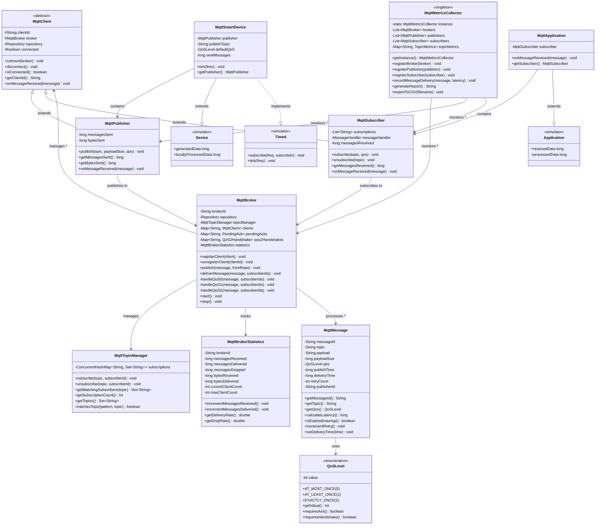
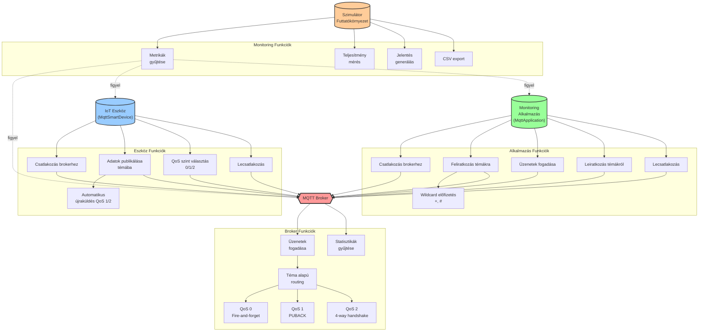
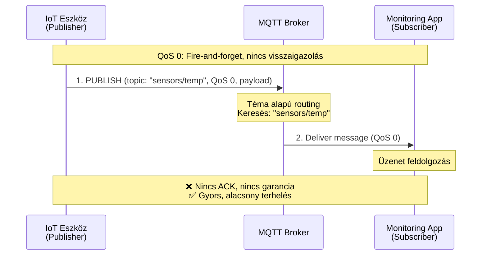
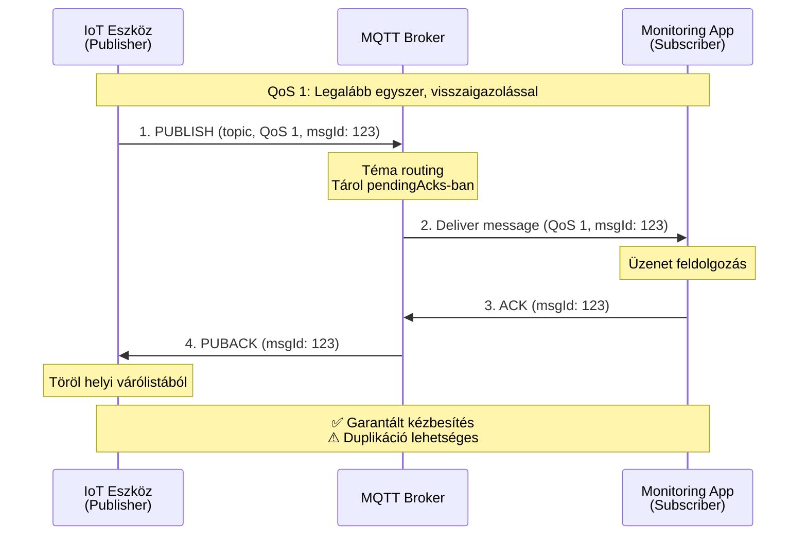
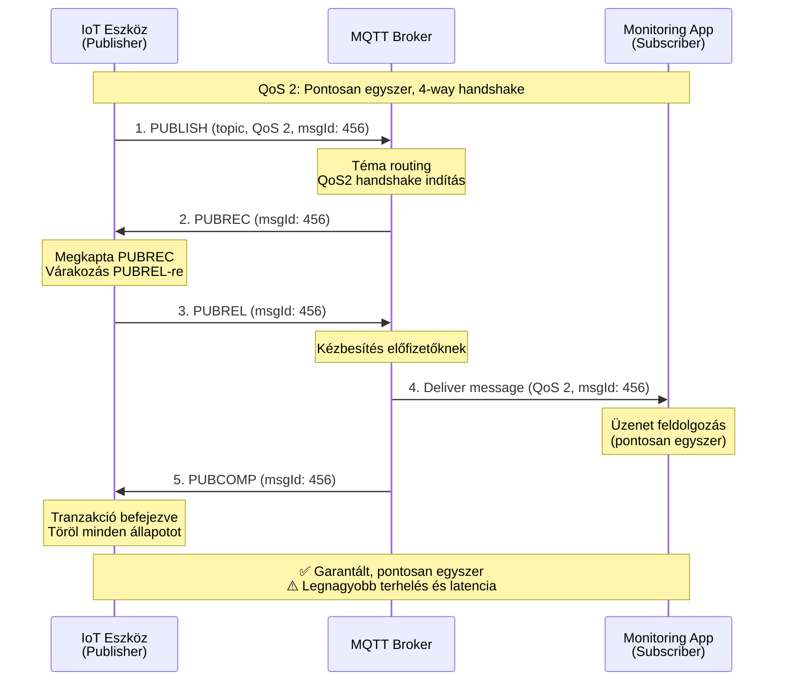
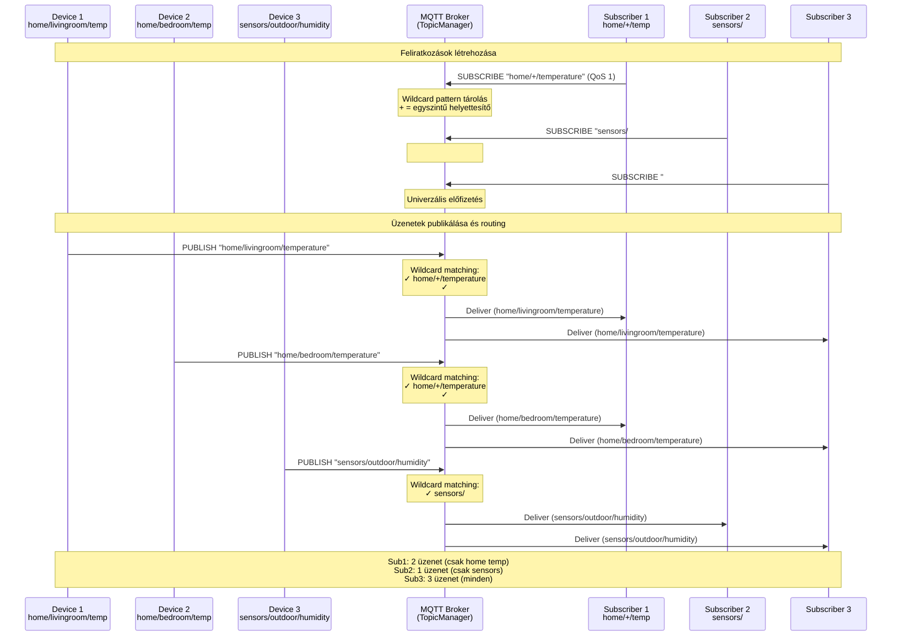
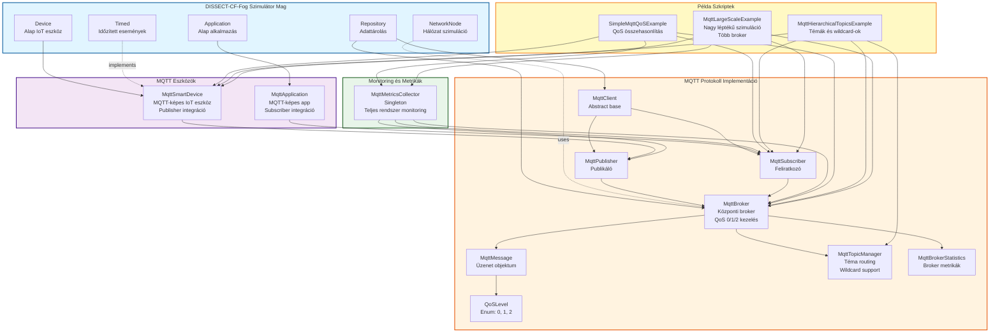
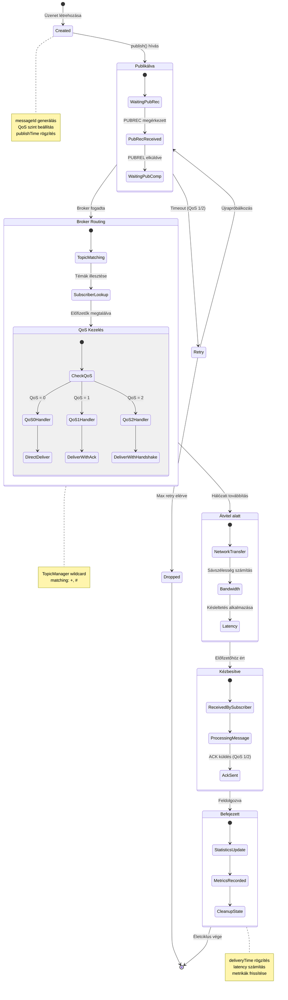

# MQTT Implementáció Diagramok

Ez a dokumentum Mermaid diagramokat tartalmaz az MQTT protokoll DISSECT-CF-Fog szimulátorban való implementációjához.

## 1. UML Class Diagram - Osztálydiagram

Az MQTT implementáció osztályszerkezete és kapcsolatai:

## 2. Use Case Diagram - Használati esetek

Az MQTT rendszer főbb használati esetei:

## 3. Sequence Diagram - QoS szintek szekvenciái

### 3.1 QoS 0 - At Most Once (Fire and Forget)

### 3.2 QoS 1 - At Least Once (Acknowledged Delivery)

### 3.3 QoS 2 - Exactly Once (Assured Delivery)

## 4. Sequence Diagram - Hierarchikus témák wildcard előfizetéssel

## 5. Component Diagram - Rendszerkomponensek

## 6. State Diagram - MQTT Üzenet Életciklus (QoS 2)

## Diagramok Magyarázata

### UML Class Diagram
Az osztálydiagram mutatja:
- **12 fő osztály** hierarchiáját és kapcsolatait
- Az öröklési láncot (Device → MqttSmartDevice, Application → MqttApplication)
- A kompozíciós kapcsolatokat (MqttBroker tartalmaz MqttTopicManager-t)
- Az összes főbb metódust és attribútumot

### Use Case Diagram
A használati esetek diagramja szemlélteti:
- **3 fő aktor**: IoT eszköz, Monitoring alkalmazás, Szimulátor
- **21 use case** funkcionális csoportokba rendezve
- A wildcard előfizetések speciális funkcióit
- A QoS szintek közötti kapcsolatokat

### Sequence Diagrams
A szekvenciadiagramok részletezik:
- **QoS 0**: 2 lépés, nincs visszaigazolás
- **QoS 1**: 4 lépés, PUBACK protokoll
- **QoS 2**: 5 lépés, teljes 4-way handshake (PUBREC/PUBREL/PUBCOMP)
- **Hierarchikus témák**: Wildcard matching működése (`+`, `#`)

### Component Diagram
A komponensdiagram bemutatja:
- A **4 fő modul** szétválasztását (Core, Protocol, Devices, Monitoring)
- Az integrációt a DISSECT-CF-Fog alaprendszerével
- A **3 példa szkript** kapcsolódási pontjait

### State Diagram
Az állapotgép diagram követi:
- Egy MQTT üzenet teljes **életciklusát**
- A **QoS 2** specifikus állapotátmeneteit
- A **hibakezelést** (retry, drop)
- A **statisztikák** gyűjtésének időzítését

---

**Használat**: Ezek a diagramok beágyazhatók bármely Markdown-ot támogató rendszerbe (GitHub, GitLab, VS Code, stb.) és automatikusan renderelődnek.
